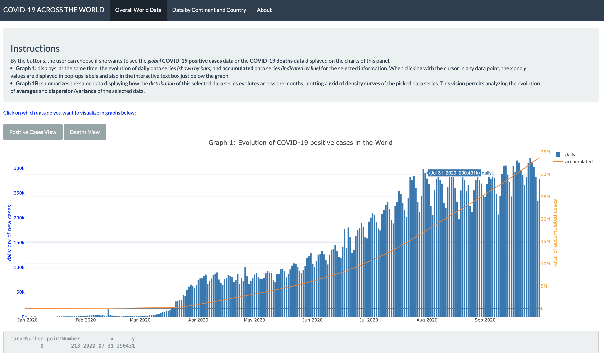

<!-- README.md is generated from README.Rmd. Please edit that file -->

# shinyCovidWorld

<!-- badges: start -->

[](https://github.com/etc5523-2020/r-package-assessment-prigrecov/actions)
<!-- badges: end -->

The goal of `shinyCovidWorld` package is embedding a Shiny application
dashboard about COVID-19 world data exploration and visualization
analysis. It makes it launching the application via a function exported
by the own package.

This embedded dashboard was previously created as an assessment product
while cursing the “ETC5523 - Communicating with Data” unit of Master in
Data Science course at Monash University. The `shinyCovidWorld` package
also refactors some parts of the application logic into R functions
exported by the package, improving the logic of the shiny application.

As an overview, the main components of this package are one dataset and
three functions as follows:

  - Data:
      - `covidData` –\> dataset with the COVID-19 cases, deaths, tests,
        positive rate, and other social and economic variables for each
        country across the world.
  - Functions:
      - `launch_app` –\> function that runs the `shinyCovidWorld`
        application.
      - `data_chart()` –\> function that pre-process this dataset
        executing some filterings, groupings and summarizings, to be
        used into plotting codes of this application.
      - `text_box()` –\> function that creates a box with a text
        instruction inside (the argument function) it in the superior
        panel of the each navigation tab of the dashboard application.

For more detailed instructions on how to use the package and the
functions contained within it access the pkgdown website:
[shinyCovidWorld](https://etc5523-2020.github.io/r-package-assessment-prigrecov/).

### The Shiny Application - **COVID-19 Across The World** dashboard

The Shiny App aims to provide an overview analysis of the Novel
Coronavirus pandemic across the world using some interactive graphs and
tables as visualization tools for this, which were built using the Shiny
framework in R.

For more details and information about the content and how the dashboard
application works go to the pkgdown website:
[shinyCovidWorld](https://etc5523-2020.github.io/r-package-assessment-prigrecov/).

## Installation

The development version of this `shinyCovidWorld` package can be
installed from [GitHub](https://github.com/) with:

``` r
# install.packages("devtools")
devtools::install_github("etc5523-2020/r-package-assessment-prigrecov")
```

## Usage

It is a basic example of how to run this package:

    library(shinyCovidWorld)
    launch_app()

## Examples

  - 1)  When you finish the installation, this is the first dashboard
        page that will be displayed in your
screen:



*\# Image from 1st page of COVID-19 Dashboard*

<br>

  - 2)  Below is displayed a sample of first rows and columns of the
        dataset embedded in this package:

<!-- end list -->

``` r
library(shinyCovidWorld)
covidData[1:10,2:7] 
#>        continent location       date total_cases new_cases new_cases_smoothed
#> 1  North America    Aruba 2020-03-13           2         2                 NA
#> 2  North America    Aruba 2020-03-19          NA        NA              0.286
#> 3  North America    Aruba 2020-03-20           4         2              0.286
#> 4  North America    Aruba 2020-03-21          NA        NA              0.286
#> 5  North America    Aruba 2020-03-22          NA        NA              0.286
#> 6  North America    Aruba 2020-03-23          NA        NA              0.286
#> 7  North America    Aruba 2020-03-24          12         8              1.429
#> 8  North America    Aruba 2020-03-25          17         5              2.143
#> 9  North America    Aruba 2020-03-26          19         2              2.429
#> 10 North America    Aruba 2020-03-27          28         9              3.429
```
